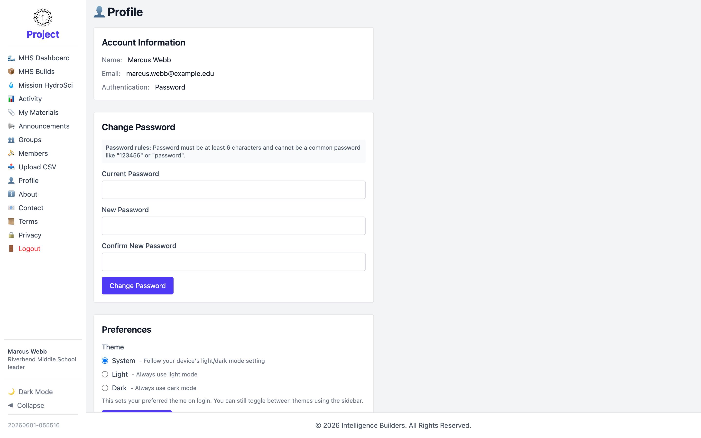

# Profile

**Profile** is your own account page. It shows your account details and lets you
change your password and theme.

<picture>
  <source media="(prefers-color-scheme: dark)" srcset="images/profile-dark.png">
  
</picture>

## Account information

Shows your **Name**, **Email**, and **Authentication** method.

## Change password

Enter your **Current Password**, then a **New Password** and confirmation, and select
**Change Password**. Passwords must be at least 6 characters and can't be a common
password.

## Preferences

The **Theme** preference sets your appearance when you sign in — **System** (follow
your device, the default), **Light**, or **Dark**. You can still switch themes any
time with the sidebar toggle. Select **Save Preferences** to keep your choice.
