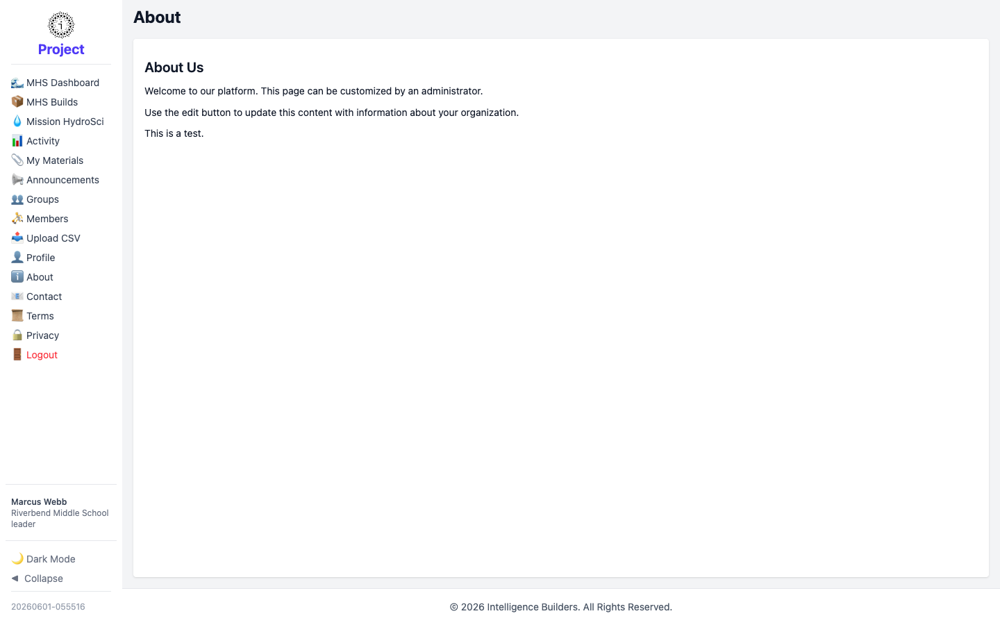

# Public pages (About, Contact, Terms, Privacy)

The **About**, **Contact**, **Terms**, and **Privacy** items at the bottom of the
menu are informational pages anyone can read. As a leader you can read them, but
their content is maintained by an administrator (you won't see an edit option).

<picture>
  <source media="(prefers-color-scheme: dark)" srcset="images/public-page-dark.png">
  
</picture>

Use these pages for organization information, contact details, and the terms and
privacy policy.
