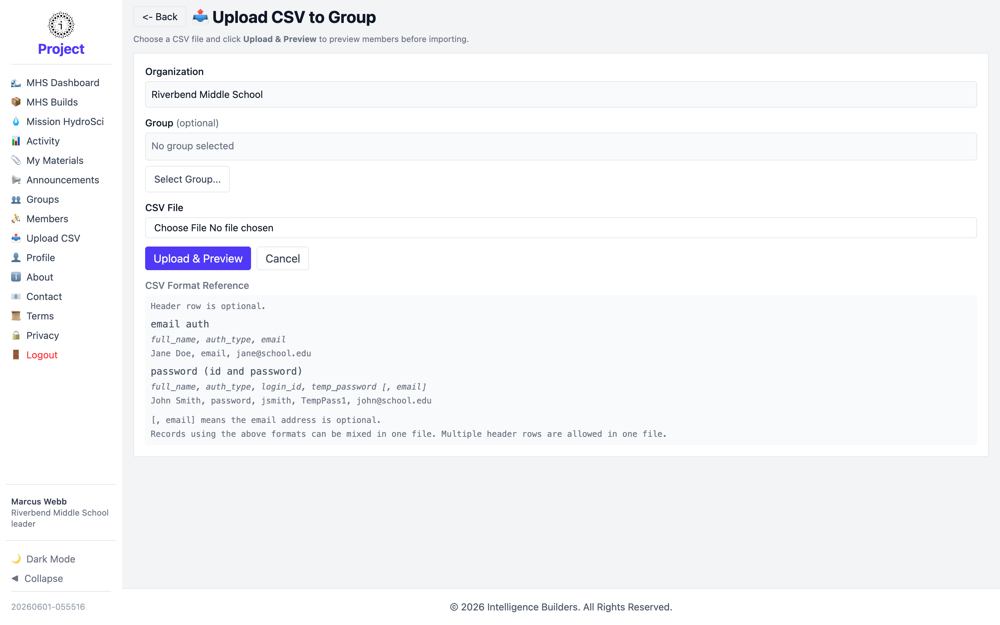

# Upload CSV

**Upload CSV** imports several members at once from a spreadsheet file, instead of
adding them one at a time — handy at the start of a term.

<picture>
  <source media="(prefers-color-scheme: dark)" srcset="images/upload-csv-dark.png">
  
</picture>

## Steps

1. **Select Organization** — your organization.
2. **Select Group** (optional) — a group to add the people to directly, or leave it
   blank.
3. **Choose File** — pick your `.csv` file.
4. **Upload & Preview** — review what will be imported before it's saved.

## CSV format

A header row is optional, and these two formats can be mixed in one file:

- **Email sign-in** — `full_name, auth_type, email`
  _Example:_ `Jane Doe, email, jane@school.edu`
- **Password sign-in** — `full_name, auth_type, login_id, temp_password [, email]`
  _Example:_ `John Smith, password, jsmith, TempPass1, john@school.edu`

The trailing `[, email]` is optional. People imported with **password** sign-in use
the temporary password the first time and are prompted to choose their own.
