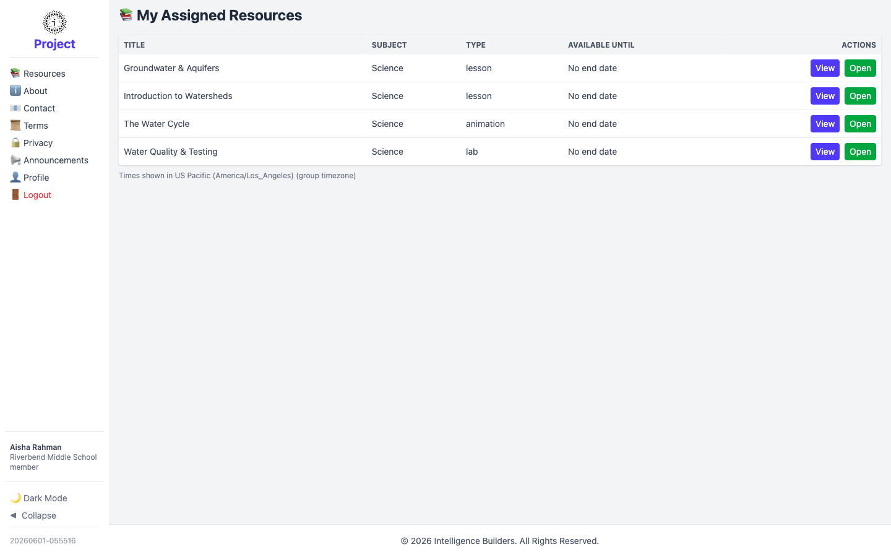
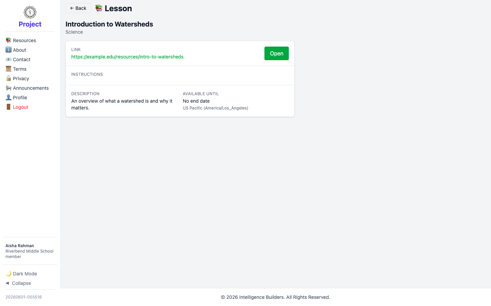

# The member view

A **member** is a student or participant. Members have the simplest experience in
Strata Hub: they sign in to find the resources assigned to their group and open
them. This guide shows what a member sees after signing in. (Creating members and
assigning resources is covered in [Getting Started](getting-started.md).)

> **Signing in:** a member signs in with the **Login ID** and temporary password
> created for their account, and is prompted to choose their own password the first
> time.

---

## Your resources

After signing in, a member lands on **My Assigned Resources** — the resources made
available to them through the groups they belong to. Each row shows the subject,
type, and how long the resource is available. Select **Open** to launch a resource
directly, or **View** to see its details first.

<picture>
  <source media="(prefers-color-scheme: dark)" srcset="images/member-resources-dark.png">
  
</picture>

---

## Opening a resource

Selecting **View** opens the resource's details — its type, subject, any
instructions from the leader, a description, and how long it stays available.
Select **Open** to launch the resource (its link or file) in a new tab.

<picture>
  <source media="(prefers-color-scheme: dark)" srcset="images/member-resource-detail-dark.png">
  
</picture>
