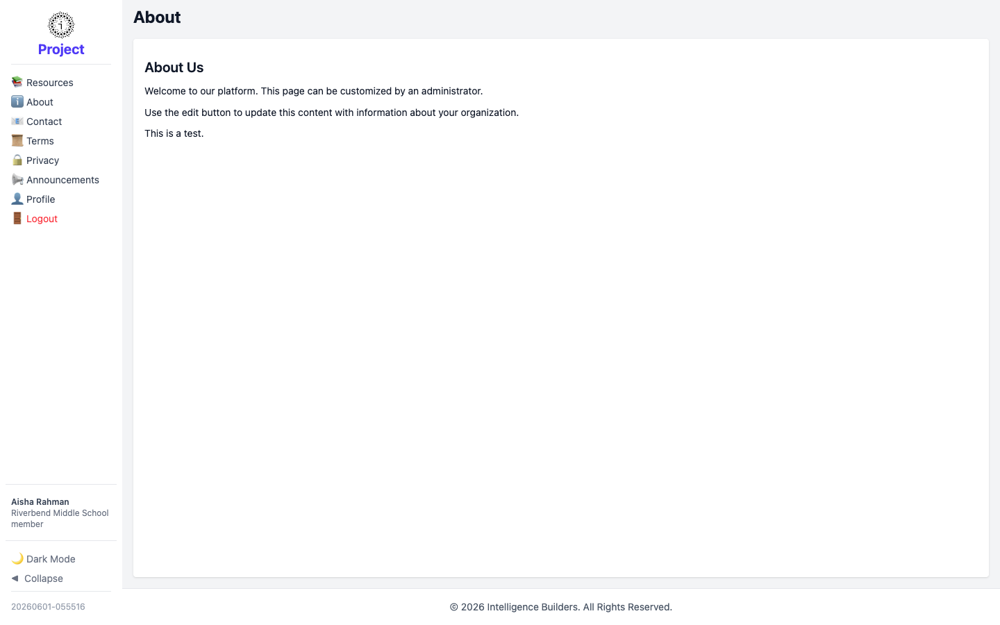

# Public pages (About, Contact, Terms, Privacy)

The **About**, **Contact**, **Terms**, and **Privacy** items in the menu are
informational pages anyone can read. As a member you can read them; their content is
maintained by an administrator.

<picture>
  <source media="(prefers-color-scheme: dark)" srcset="images/public-page-dark.png">
  
</picture>

Use these pages for organization information, contact details, and the terms and
privacy policy.
