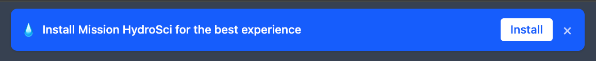
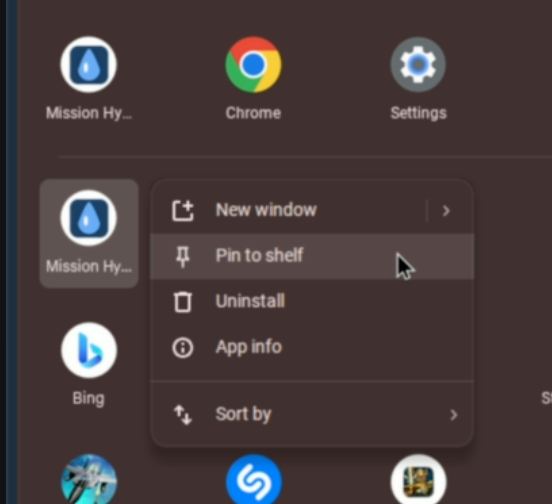
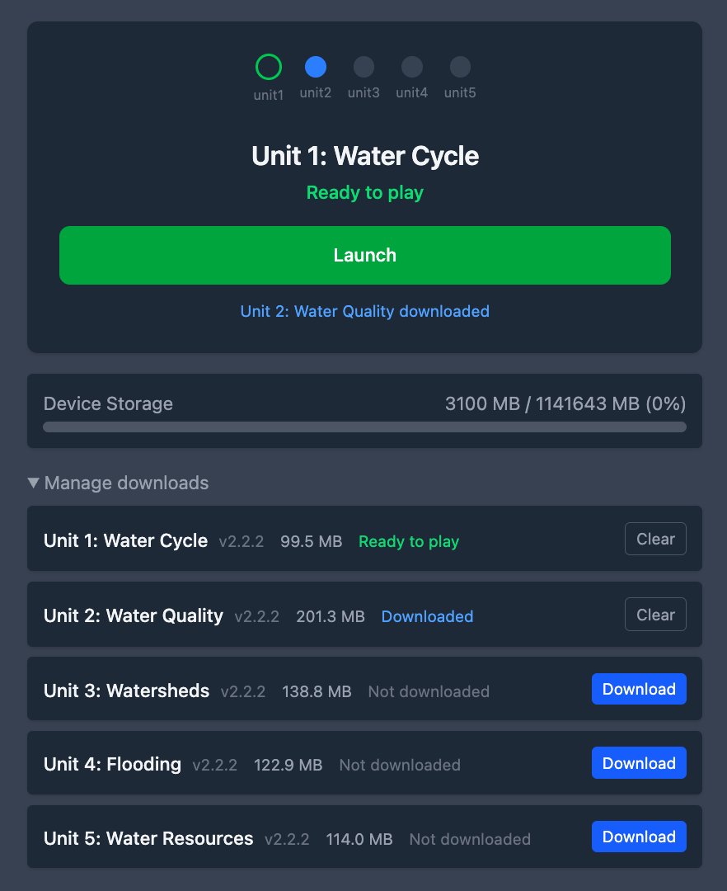
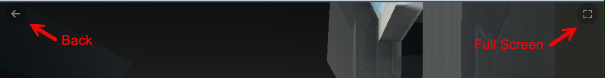
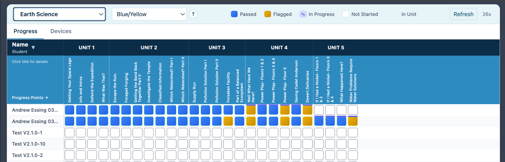

# Mission HydroSci — Teacher Guide (Impact Study)

## Getting Started

### Accessing Mission HydroSci

1. On each student Chromebook, open Chrome and go to **mhs.adroit.games**
2. Students log in with their **Login ID**
3. After logging in, students will see a sidebar menu on the left. Click **Mission HydroSci** to open the game

### Installing the App (Recommended)

After logging in, students will see a blue banner at the top of the Mission HydroSci page:

> **Install Mission HydroSci for the best experience**

1. Click the **Install** button on the banner
2. Chrome will ask to confirm — click **Install**
3. The app installs and can be found in the Chromebook's app launcher

**Pinning to the shelf (bottom bar):**

4. Click the **Launcher** button (circle icon, bottom-left corner of the screen)
5. Find **Mission HydroSci** in the app list (or type it in the search bar)
6. Tap the trackpad with **two fingers** on the Mission HydroSci icon (this is how you right-click on a Chromebook)
7. Select **Pin to shelf**
8. The icon now stays in the bottom bar for quick access

Installing the app gives students a cleaner, near-fullscreen experience without the browser address bar and tabs.

**If the banner doesn't appear**, the app may already be installed, or Chrome may not be ready yet. Students can still use Mission HydroSci in the browser — installation is not required to play.

---

## Playing the Game

### The Units Page

After opening Mission HydroSci, students see:

- **Progress dots** at the top showing which units are complete (filled green), current (green outline), or upcoming (gray)
- The **current unit** title and its status
- A **Download** button (blue) and a **Launch** button (green)

### Downloading a Unit

Before a unit can be played, it needs to be downloaded to the device:

1. Click the blue **Download** button
2. A progress bar shows the download progress
3. When the status changes to **Ready to play**, the green **Launch** button appears
4. The next unit will begin downloading automatically in the background

Downloads are large (100–200 MB per unit) and require an internet connection. Once downloaded, units load faster and more reliably from the device. **Students should always be connected to the internet when playing** — the game needs a connection to save progress and log activity.

**If a download fails**, a **Retry** button will appear. Click it to try again. If downloads repeatedly fail, check the internet connection or see the Troubleshooting section below.

### Launching a Unit

1. Click the green **Launch** button
2. A loading screen appears with a progress bar — wait for it to finish
3. The game loads and fills the screen

### In-Game Controls

While playing, a **← (Back)** button appears in the top-left corner of the screen. Click it to return to the Units page if a student needs to stop playing mid-unit.

### Fullscreen Mode

The installed app already provides a near-fullscreen experience without the browser address bar and tabs.

**On a Chromebook**, use the **fullscreen key** on the top row of the keyboard (the key that looks like a rectangle, typically the 4th or 5th key from the left) to enter and exit fullscreen. This works in both the installed app and in the browser. All top-row keys (volume, brightness, etc.) continue to work normally. Students can also exit fullscreen by pressing and holding **Esc** for two seconds.

**On macOS or Windows** (no fullscreen key), an in-game fullscreen button (⛶) appears in the top-right corner of the screen. Click it to enter fullscreen. To exit, press and hold **Esc** for two seconds.

### Completing a Unit

When a student finishes a unit:

1. A **Unit Complete** overlay appears
2. The next unit downloads automatically (if not already downloaded)
3. Once ready, the next unit loads automatically
4. After the final unit, a **Back to Mission HydroSci** button appears

Progress is saved automatically. If a student closes the app and returns later, they will resume from where they left off.

---

## Important Reminders for Students

- **Always play while connected to the internet.** The game needs a connection to save progress and log activity. If a student plays without a connection, their progress may not be saved.
- **Don't share Login IDs.** Each student's progress is tied to their Login ID. If two students use the same ID, their progress will overwrite each other.
- **Don't clear the browser's data or cache.** This deletes all downloaded units and the student would need to re-download everything.
- **Progress saves at specific checkpoints within each unit**, not continuously. If a student stops playing between save points, they will need to replay from the last save when they return.

---

## Managing Downloads and Storage

### Viewing Storage

On the Units page, students can see a **Device Storage** bar showing how much space is used on the device.

### Manage Downloads

Click **Manage downloads** to expand a section showing all units with their download status:

- **Downloaded** — ready to play
- **Not downloaded** — needs to be downloaded before playing
- **Partial** — download was interrupted

From this section, students can:

- Download specific units manually
- **Clear** a downloaded unit to free up space (the unit will need to be re-downloaded to play again)

### Low Storage

If device storage is above 90% full, a warning appears:

> **Low storage — auto-download of next unit paused**

Students should clear completed units they no longer need, or ask a teacher for help freeing up space on the device.

---

## Troubleshooting

### "Download failed" or downloads won't start
- Check the Chromebook's internet connection (Wi-Fi)
- Try clicking **Retry**
- If storage is low, clear completed units from **Manage downloads**
- Restart Chrome and try again

### Game won't load after clicking Launch
- Make sure the unit shows **Ready to play** status
- Try refreshing the page
- If offline, the unit must be downloaded first

### Student can't find Mission HydroSci in the menu
- Make sure the student is logged in to the correct account
- Mission HydroSci appears in the left sidebar after login

### Top-row keys not working (volume, brightness, etc.)
- Use the Chromebook's **fullscreen key** (top row) to enter and exit fullscreen — top-row keys will work normally
- If fullscreen was entered using the in-game ⛶ button (browser on macOS/Windows), exit by pressing and holding **Esc** for two seconds

### App looks different from the browser version
- The installed app and the browser version are the same — the app just hides the browser chrome (address bar, tabs) for a cleaner experience

### Student lost progress
- Progress is saved automatically as units are completed
- If a student is logged in to a different account, they will see that account's progress
- Check that the student used the correct Login ID

---

## MHS Dashboard (For Teachers)

As a leader, you have access to the **MHS Dashboard** in the sidebar menu. The dashboard has two tabs: **Progress** and **Devices**.

Use the group selector dropdown at the top to choose which class you want to view.

### Progress Tab

The Progress tab shows a grid of student progress across all five units of Mission HydroSci.

**Reading the grid:**

- **Rows** are students in the selected group, sorted alphabetically by name
- **Columns** are progress points — specific checkpoints within each unit where student performance is evaluated
- Each unit contains multiple progress points (4–7 per unit, 26 total across all five units)

**Cell colors indicate status:**

| Color | Meaning |
|-------|---------|
| **Blue** (solid) | **Passed** — student completed this progress point successfully |
| **Yellow** (solid) | **Flagged** — student completed it but may need attention (see below) |
| **Indigo with ✎** | **In Progress** — student is currently working on this progress point |
| **Empty** | **Not Started** — student hasn't reached this point yet |

A horizontal bar above a row indicates which unit the student is currently in.

**Understanding flagged cells:**

A yellow/flagged cell means the student completed the progress point but their performance was outside expected bounds. Click any flagged cell to see details, including:

- What the issue was (e.g., "Student used more targets than allowed" or "Student needed hints or made too many incorrect attempts")
- Suggested actions for the teacher

Flagged cells are informational — they highlight students who may benefit from additional support or a conversation about the activity.

**Note:** For **Units 1–3**, clicking a flagged cell shows specific information about what the student struggled with and suggested actions. For **Units 4 and 5**, the flagged cell will show a general statement that the student's performance was outside expected bounds, but will not include specific details about the issue. Detailed performance measures for Units 4 and 5 are still being developed.

**Other features:**

- Click any progress point column header to see a description of what that checkpoint covers
- Click the **Name** column header to toggle sort order (A–Z or Z–A)
- The dashboard auto-refreshes every 30 seconds, or click **Refresh** to update manually
- Use the **Theme** dropdown to change colors for accessibility (colorblind-friendly options are available)

### Devices Tab

The Devices tab shows which students have their Chromebooks set up and ready to play.

**Columns:**

| Column | What it shows |
|--------|---------------|
| **Student** | Student name |
| **Device** | Device type (e.g., "Chromebook") |
| **PWA** | ✓ if the app is installed, — if not |
| **Unit 1–5** | Download/readiness status for each unit (see below) |
| **Storage** | How much device storage is used (bar + percentage) |
| **Last Seen** | When the device last connected |

**Unit readiness indicators (colored dots):**

| Dot | Meaning |
|-----|---------|
| **Blue solid** | Downloaded and ready to play |
| **Blue outline** | Currently downloading |
| **Green solid** | Unit completed |
| **Green outline** | Current unit (in progress) |
| **Gray** | Not downloaded — student needs to download this unit |

**How to use the Devices tab:**

Before a class session, check the Devices tab to confirm students are ready:

1. **PWA column** — students with ✓ have the app installed. Students with — should follow the installation steps at the start of class.
2. **Unit dots** — look for blue or green solid dots on the unit students will be playing. Gray dots mean the student needs to download that unit first.
3. **Storage** — if a student's storage bar is red (above 90%), they may need to clear completed units to make room for new downloads.
4. **Last Seen** — dates shown in faded/amber text are older than 7 days, meaning that device hasn't connected recently.

If a student has multiple devices, they'll appear on separate rows grouped under the same name.

---

## Quick Reference

| Action | How |
|--------|-----|
| Access the app | Go to **mhs.adroit.games** in Chrome |
| Log in | Enter the student's **Login ID** |
| Open the game | Click **Mission HydroSci** in the sidebar |
| Install the app | Click **Install** on the blue banner |
| Download a unit | Click the blue **Download** button |
| Play a unit | Click the green **Launch** button |
| Go back to units | Click **←** (top-left corner) |
| Go fullscreen | Press the Chromebook **fullscreen key** (top row) |
| Exit fullscreen | Press the **fullscreen key** again, or hold **Esc** for 2 seconds |
| Check progress | Leaders: open **MHS Dashboard** |
| Manage storage | Click **Manage downloads** on the Units page |
